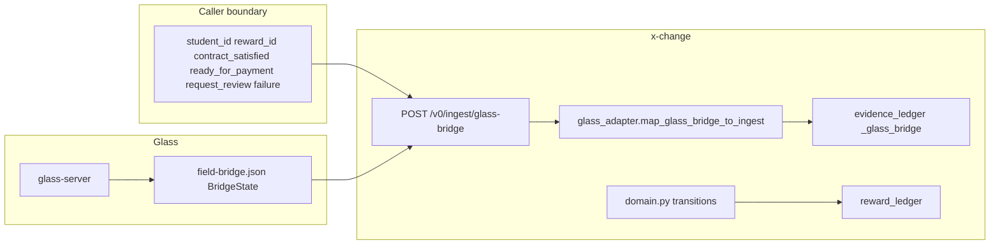

# Glass + x-change — audit vs Anthropic Financial Services release

**Audit date:** 2026-05-07
**Release reference:** `anthropics/financial-services` (Claude marketplace `claude-for-financial-services`)
**Installed inventory (this host):** `gl-reconciler`, `month-end-closer` (enabled); `financial-analysis` (failed to load — `hooks.json` is `[]` vs expected object); see `claude plugin list`.

This document adds **Glass** to the evaluation pipeline and audits the **combined boundary** against the same structural themes used in the FSI bundle (evidence vs posting, MCP-shaped truth, human sign-off, exception workflows).

---

## 1. Pipeline surface (Glass in the loop)

**Authoritative contracts:** `glass-contract-v0.md`, `policy-core-v0.md`, `INTEGRATION-SPIKE.md`, `glass_adapter.py`.

| Stage | What moves | Policy rule |
|-------|----------------|---------------|
| Glass → bridge file | Spatial/session telemetry (`agent_state`, `threshold_state`, `signals`, blocks, conversation, …) | Glass does **not** carry `student_id` / reward policy flags. |
| Caller → HTTP | Enrichment booleans + ids | Only explicit fields may **propose** transitions. |
| Adapter | `_glass_bridge` embedded in ingest payload | **No inference** from Glass fields to policy booleans. |
| Storage | `EvidenceType.GLASS_SESSION_EVENT`, provenance `glass_ingest` | Evidence is **audit trail**, not a write path to Stripe or ledger bypass. |
| Domain | `next_state_after_glass_evidence` | Validates proposals; **single choke point** for lifecycle. |

**Bidirectional:** x-change does **not** write back to Glass (`glass-contract-v0.md`).

---

## 2. Audit checklist — structural themes vs FSI release

Themes are taken from the **installed** agent prompts (`gl-reconciler`, `month-end-closer`) and the FSI README posture (staged outputs, no binding execution), not from IB/ER modeling content.

| Theme (FSI release) | Glass + x-change today | Verdict |
|---------------------|-------------------------|---------|
| **Trusted internal vs untrusted external** | GL agents: custodian PDFs untrusted; reader workers isolated. | Glass bridge JSON is **telemetry**, not a financial counterparty — closer to **internal session subledger**. Still: **not validated as cryptographic truth**; treated as **evidence blob** only → aligns with “do not treat ambient inputs as posting authority.” |
| **Orchestrator / reader does not post** | GL: orchestrator never writes GL; resolver formats for sign-off. | x-change: **HTTP ingest does not** call Stripe or mutate payment state from Glass; Stripe is **separate webhook** with HMAC. Glass path **cannot** confirm payment. **Strong match.** |
| **Exception queue → human** | GL: break list + exception report. | x-change: `support_signals` + `POST .../resolve`; Stripe mismatches → signal, not silent fix. **Strong homology** (different domain objects, same control topology). |
| **MCP as system-of-record access** | Agents name `mcp__internal-gl__*`, `mcp__subledger__*`. | Neither Glass nor x-change exposes MCP to Claude Code **from this repo**. Pipeline is **HTTP + file bridge** only. **Gap vs FSI tooling** — not a violation of your policy. |
| **Period close packages** | Month-end: TB, accruals, roll-forwards, variance. | No GL/TB. **Optional analogy:** monthly export of `payment_confirmations` + `reward_ledger` + open `support_signals` as a “close pack” — **documentation / agent skill** fit, not native data. |
| **Market-data MCP bundle** | `financial-analysis/.mcp.json` vendor URLs. | **Orthogonal** to Glass evidence and x-change SQLite. No natural merge point. |

---

## 3. Relevancy scoring — **Glass + x-change** vs installed FSI inventory

Same rubric as the standalone x-change benchmark: subscores **D** (data affinity), **W** (workflow homology), **A** (activation as-is), **S** (semantic safety), each 0–10; composite = round((0.35×D + 0.35×W + 0.20×A + 0.10×S)×10).

**Baseline:** x-change-only composites were approximately **gl-reconciler ~34**, **month-end-closer ~22**, **financial-analysis ~6** (broken load).

**Adjustment when Glass is included in the “system under review”:**

| Installed unit | Δ vs x-change-only | Rationale | New composite (indicative) |
|----------------|-------------------|-----------|------------------------------|
| **gl-reconciler** | **W +1, S +1** | Glass bridge is extra **evidence** for “session activity / work done” narratives; GL agent’s **break-trace / reader** story maps metaphorically to **telemetry + explicit caller gates**, not to GL lines. **A unchanged** — still no `mcp__internal-gl__` to your DB. | **~38** |
| **month-end-closer** | **W +0–1** | Slightly richer **time-series** evidence (`signals.*`, session age) for **commentary-style** monthly summaries if you ever generate Markdown from exports; still no accrual objects. **A unchanged.** | **~24** |
| **financial-analysis** | **~0** | Modeling/deck/MCP vendors do not consume `field-bridge.json`. Still broken at load. | **~6** |

**Interpretation:** Glass **raises governance alignment** (evidence discipline, read-only semantics) with the **same** FSI agents; it does **not** remove the **activation gap** (their tools expect GL MCPs you do not run).

---

## 4. Candid “effortless integration” map

| Integration | Effort | Honest fit |
|-------------|--------|------------|
| Use **gl-reconciler** prompt patterns when writing **skills** that triage `support_signals` using **exported** ledger JSON + Glass `_glass_bridge` excerpts | Low (prompt/docs) | **High** — same staged exception report shape. |
| Point **financial-analysis** MCP URLs at Glass | N/A | **None** — different problem class. |
| **glass-server** writes bridge; operator or automation calls `ingest/glass-bridge` | Already designed | **Native** — no FSI dependency required. |
| Claude **reads** `field-bridge.json` + calls x-change HTTP with explicit flags | Devops / agent wiring | **Natural** — matches “reader has context, resolver does not auto-post.” |

---

## 5. Findings summary

1. **Glass strengthens the audit story against the FSI release:** session telemetry is **explicitly non-authoritative** for policy (`glass-contract-v0.md`), parallel to FSI agents marking **outsider content untrusted** and refusing ledger posts.
2. **No new relevancy to modeling verticals** (DCF, comps, vendor MCP) — Glass does not change that.
3. **Operational relevancy** (recon / close **patterns**) ticks up slightly because Glass adds **time-stamped, structured work evidence** you could attach to exception narratives — still **human-in-the-loop** for `resolve` and for enrichment booleans.
4. **Installed `financial-analysis` remains a process defect** until `hooks.json` is a valid object; treat as **out of scope** for this pipeline until fixed upstream or patched locally.

---

## 6. Optional follow-ups (out of scope for this audit)

- MCP server exposing read tools over `evidence_ledger` (including `_glass_bridge`) + `support_signals` — closes the same gap as FSI’s connector model.
- Single Markdown template: “monthly x-change close pack” fed by `GET /v0/outcomes/summary` + signal export — **homage** to month-end-closer without GL semantics.

---

## See also

- [`evaluation/README.md`](evaluation/README.md) — post-integration dual audits, complement matrix, combo trial record, asset index
- [`anthropic-financial-services-integration.md`](anthropic-financial-services-integration.md) — marketplace install, MCP fragment location
- [`glass-contract-v0.md`](glass-contract-v0.md) — adapter rules
- [`policy-core-v0.md`](policy-core-v0.md) — policy choke point
- [`finance-agents-modernization.md`](finance-agents-modernization.md) — MCP phased roadmap
